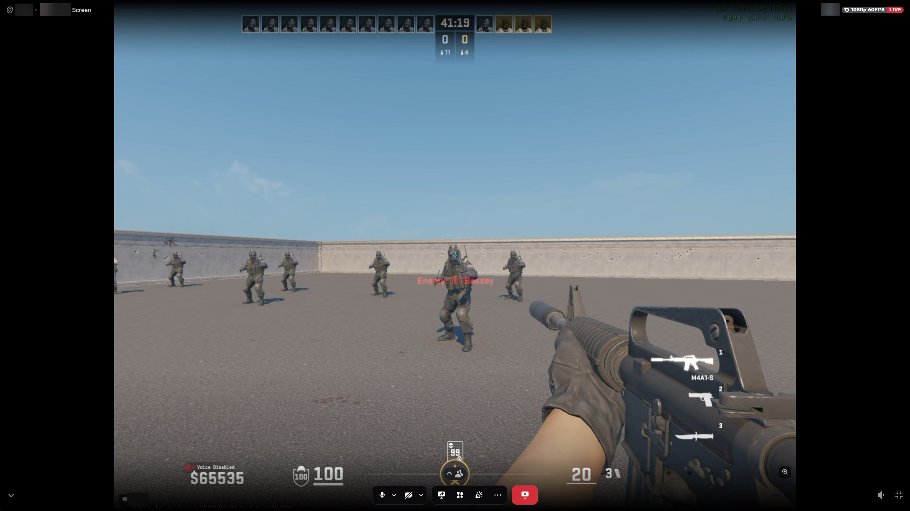
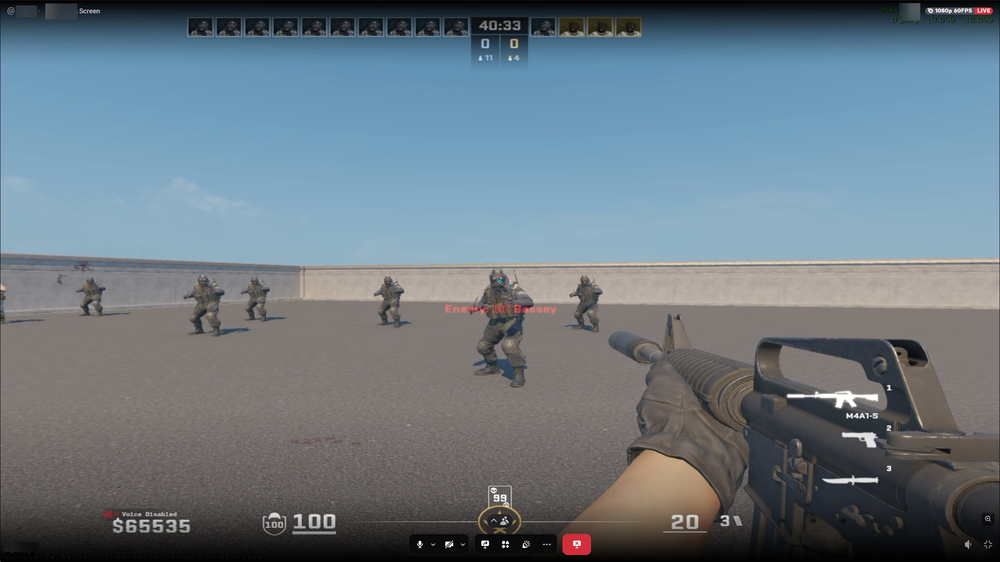
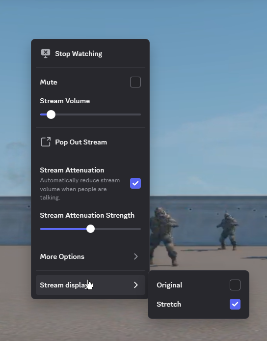

# stream-display

vencord plugin that allows you to stretch incoming discord screenshares

| original | | stretch |
| :---: | :---: | :---: |
|  | -> |  |

right click the stream -> stream display -> stretch. original turns it off

## install

install [vencord](https://vencord.dev/download) first and open discord once

close discord, [download the zip](https://github.com/rh234/stream-display/releases/latest/download/Stream-display-easy-install.zip), extract it and run `Install.cmd`

windows only. backs up and replaces your vencord build. it won't be auto updated. other custom plugins aren't included

## build

run `build.cmd`. files go in `dist/`
